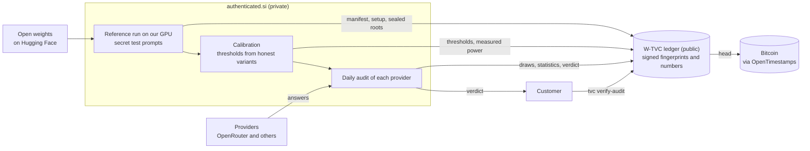
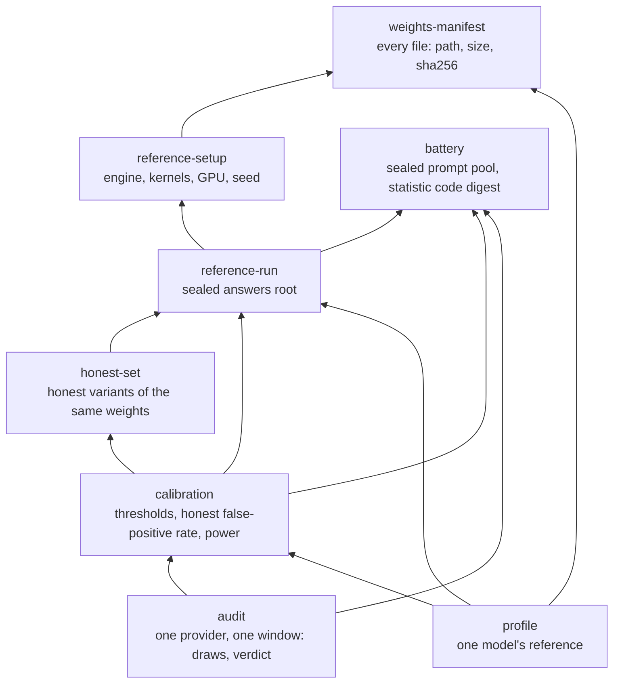

# W-TVC

Bitcoin showed you don't need a bank to trust a payment. W-TVC applies the same idea to AI: you shouldn't need a frontier lab to decide which questions you may ask. Open models let anyone answer anything, but today you can't trust the providers who serve them, because a provider can quietly serve any model under any name. W-TVC builds that trust without a central party.

It's the open protocol behind [authenticated.si](https://authenticated.si), which tests the providers that sell open models (DeepSeek, Qwen, gpt-oss and others) against the real model, with secret prompts. W-TVC publishes what anyone needs to trust those results, without publishing the prompts:
- which exact weight files the reference used, checkable against Hugging Face;
- how the reference was run;
- sealed fingerprints of the secret prompts and answers;
- the thresholds each test uses, the false-positive rate they give on honest providers, and what they catch;
- every provider check: which prompts it had to use, its numbers and its verdict.

All of it is signed, kept in an append-only ledger, and timestamped in Bitcoin. Anyone can verify it with one command, offline, without trusting authenticated.si.

Built for **Bitshala BOSS Battle** · Tracks: **Machine Money** × **Freedom Stack**

> **Judges: start with the [10-minute demo walkthrough](docs/demo-walkthrough.md).** Every command in it was run from a fresh clone. It builds the tool, verifies a real GPU reference and two provider verdicts, catches a tampered threshold, opens a sealed test question with a proof, and checks the Bitcoin timestamps.
>
> **What's real today:** 9 open models tested on our own GPUs; 12 of 12 swapped models caught, 5 of 5 4-bit copies caught; the Qwen2.5-7B reference, its calibrations and two demo verdicts published here and anchored in Bitcoin blocks 969564 to 969658. **Not yet:** no real provider has been checked; FP8/8-bit detection varies by model.

```
Ship code. Beat the boss.
```

## Why this matters

**Bitcoin removed the need to trust a bank** to move money: anyone can check the rules, nobody can block a payment, and trust comes from verification instead of from an institution. AI needs the same thing.

**Today, a few frontier labs decide what you may ask.** ChatGPT, Claude and Gemini choose which questions they'll answer and which they'll refuse, and they see everything you send. Nobody should need a company's permission to get an answer.

**Open models are the way out.** Anyone can run them, many independent providers host them, and you can switch whenever you like. That's the AI version of not needing a bank.

**But open models are only as trustworthy as whoever serves them.** On a marketplace like OpenRouter, a provider can sell you "DeepSeek" and serve a cheaper compressed copy, or a different model entirely, and you have no way to tell. Without a way to check, people either go back to the gatekeepers or trust an anonymous reseller blindly.

**W-TVC builds that trust, the Bitcoin way:**
- **Verify, don't trust.** authenticated.si checks providers against the real model, so you can choose accountable providers and ask your questions with confidence.
- **No new gatekeeper.** Every reference, threshold and verdict is signed and published, so anyone can check the checker. You don't have to trust authenticated.si either.
- **Secret tests, public proof.** The test questions stay secret so providers can't game them, but their fingerprints are fixed in public before any provider is tested.
- **Bitcoin as the clock.** Records are timestamped in Bitcoin, which no company or government controls, so nobody can quietly rewrite them later, including us.

The same values that make Bitcoin useful (no central party, rules anyone can check) make open AI usable: more choice of models and providers, the freedom to ask what you want, and the confidence that you got the model you paid for.

## Where it's used



The prompts and answers stay at authenticated.si. Only salted Merkle roots of them reach the ledger. A single one is opened, with a proof, when a verdict is disputed. The sequence of a daily check, the document graph and a chart of what the tests catch are in [`docs/how-it-works.md`](docs/how-it-works.md).

## The problem

Providers sell access to open models by name, and some serve a cheaper model or a 4-bit copy under that name. On 5 May 2026 a strict client caught a private-inference gateway answering as `Qwen/Qwen3.5-122B-A10B` while billing for `deepseek-ai/DeepSeek-V3.1` ([awesome-private-inference](https://github.com/amiller/awesome-private-inference)).

The way to catch this from outside is to compare the endpoint with reference answers produced by running the real model yourself. That's what our checking service, [authenticated.si](https://authenticated.si) (SPOT), does. But every verdict then rests on the reference, and a provider flagged as "likely swapped" will ask four fair questions:

1. Which weights did you run?
2. How did you run them?
3. Which prompts did you use, and what did your model say?
4. Did you change your reference after you saw my output?

Today the honest answer to all four is "trust us". W-TVC replaces that with things a third party can recompute.

## What W-TVC publishes

A reference is a set of signed documents, each naming the ones it builds on by SHA-256. Protocol v2 adds the documents a verdict is judged by.



The signed claims go in an append-only, hash-chained ledger (`registry.jsonl`). The documents sit beside it as `objects/<sha256>.json`, so `sha256sum` on any of them prints its own file name. The ledger head is submitted to the OpenTimestamps calendars and ends up in a Bitcoin block. Every proof is kept in `anchors/`.

| The provider asks | What answers it | How anyone checks |
|---|---|---|
| Which weights? | the weights manifest | `tvc check-hf` compares it with the SHA-256 Hugging Face publishes for every large file, so 988 MB of weights are checked without downloading them. `tvc verify-dir` re-hashes a local copy. |
| How were they run? | the setup record | It can't be changed after publication, and it's specific enough to re-run. It's the publisher's own description, and it says so. |
| Which prompts, which answers? | the run record's two roots | When a verdict is disputed, `tvc reveal` opens the prompts in question with a Merkle proof. `tvc verify-reveal` confirms they were in the set at publication, at that position. |
| Changed afterwards? | ledger order and the Bitcoin timestamp | A record can only cite records already in the ledger, and the anchored head dates the whole ledger up to that point. |
| Were the thresholds fair, and set before you tested me? | the calibration | It's built from honest variants of the same weights and publishes their false-positive rate. `tvc verify-audit` checks it was anchored before the audit was recorded. |
| Did you pick prompts to make me look bad? | the audit's draws | The indices re-derive from the sealed pool, the endpoint and the date. `tvc verify-audit` recomputes them, and the verdict. |

The prompts stay secret on purpose. If they were public, a provider could recognise them and send only those to the real model. So SPOT commits to them first and reveals them one at a time, when there's a reason to. I think this is the one place where publishing everything would make the system easier to cheat.

## Try it

Five commands, from the repository root. None of them needs a GPU, and only the last two touch the network.

```bash
cargo test --workspace

# The whole story offline, ending with five cheating attempts that get refused.
cargo run --release --bin tvc -- demo

# Check the real reference in reference/ as an outsider would.
cargo run --release --bin tvc -- verify-reference --registry reference/registry.jsonl \
  --profile dc7d054fbd75b6c74055ab3e6c074c5a28e3606296e0a3afce05372a92616374 \
  --publisher 8f738e4f8e4b3ce2b820dcc9cea88635f0992a56f23eccbc4b5a8d968db421cd

# Compare the published Qwen manifest with Hugging Face, without downloading the weights.
cargo run --release --bin tvc -- check-hf \
  --manifest reference/objects/3f976cbf5f3e4ad9b15f23c1a16987851be036b2179d1025e983f4c68b2cf82c.json

# Ask the calendar whether the ledger head has reached a Bitcoin block yet.
cargo run --release --bin tvc -- verify-anchor --registry reference/registry.jsonl
```

`verify-reference` prints nine named checks and exits non-zero on the first class of failure: 2 ledger, 3 signature, 4 document, 5 weights on disk, 6 anchor. Add `--json` for machine output. [`docs/verify-yourself.md`](docs/verify-yourself.md) walks through every claim with commands you can paste.

## A real reference: Qwen2.5-0.5B-Instruct

`reference/` holds a ledger built on 2 October 2026 (IST) under a demo publisher key, `8f738e4f`. It isn't SPOT's production key. The ledger head `0fd05073` was submitted to the OpenTimestamps calendar at 2026-10-01 19:51 UTC.

There are two profiles, because there are two artefacts:

- **Skeleton** (`0a372de8`). The Hugging Face safetensors at commit `7ae557604adf`. All eight files match the hub. `model.safetensors` matches the hub's LFS hash `fdf756fa` without being downloaded. There are no runs, because this machine has no PyTorch build for its Intel CPU and Python 3.14, so it can't run safetensors. The handbook calls a profile like this a skeleton.
- **Working** (`dc7d054f`). Ollama's `qwen2.5:0.5b` build of the same model, a 4-bit `Q4_K_M` GGUF, run with Ollama 0.24.0 on an Intel Core i9-9980HK with no GPU. Twelve prompts, three samples each at temperature 0 and seed 42. All twelve reproduced byte for byte across samples. The bands hold only measured values: Ollama counted 195 prompt tokens over the four tokenizer prompts and 554 over all twelve, identical on every sample.

The two builds have different manifests (`3f976cbf` and `1fc98d37`), as they should. That gap is exactly the "quantised copy" case SPOT exists to catch. The setup record also pins Ollama's default system prompt for this tag ("You are Qwen, created by Alibaba Cloud. You are a helpful assistant."), which a provider could otherwise change silently.

The reference also records the model's wrong answers. It says the capital of Australia is Sydney, and that 4821 × 37 is 159674 (it's 178377). A reference is what the real model says, not the right answer. An endpoint selling this model that gets those right is serving something else. Both prompts are opened, with proofs, in [`reference/reveals/`](reference/reveals/). The other ten stay sealed.

The harness that produced the run is [`reference/run_ollama_reference.py`](reference/run_ollama_reference.py). It uses the standard library only.

## A GPU reference, and what the tests catch: Qwen2.5-7B-Instruct

The second reference was run on an NVIDIA L4 with vLLM 0.30.0, as an [OpenResearch](https://github.com/alphaXiv/OpenResearch) experiment tree: one git branch per question, one fixed run command, every number printed to the run log. The harness, the prompt sets and the write-ups are authenticated.si's and live in a private repository. Each test follows a published method, so its results can be compared with the paper: prompt-token counts (AgentProv, arXiv 2609.00052), answer distributions (One Token Is Enough, arXiv 2607.10252), rank uniformity (RUT, arXiv 2506.06975), kernel two-sample tests (MET, arXiv 2410.20247) and random-generation probes (IRIS, arXiv 2607.20860).

**Round 1: which engine makes the reference.** With vLLM's default kernels, 12 of 32 greedy answers changed depending on what else was in the batch. With its batch-invariant kernels, 32 of 32 stayed the same, at 5-8% lower throughput. So the reference is run batch-invariant: anyone with the same stack gets the same reference. A provider won't run that stack, so the reference is still compared as a distribution of answers, not as exact strings.

**Round 2: honest providers against substitutes.** Ten sample sets were collected against the reference. Five are honest variants of the same weights (default kernels, 8 sequences per batch, prefix cache off, CUDA graphs off, fp16). Five are cheaper things a provider could serve instead.

- With a plain p-value, the MET test flags all five honest variants (p = 0.001). Kernel choice alone moves the output distribution enough to be seen. This matches what the literature reports for real providers.
- With the threshold taken from the honest variants (95th percentile of the statistic, each honest variant judged only against the others), honest variants are flagged 6-10% of the time on average.
- At that threshold, a 4-bit AWQ copy, Qwen2.5-3B and Qwen2-7B are flagged by every test at every budget down to 5 samples per prompt. Online fp8 (weights and activations) is flagged 95% of the time at 10 samples per prompt.
- An 8-bit weight-only copy (GPTQ int8) is not flagged by anything. It sits at the honest rate.
- The prompt-token check alone catches an injected provider system prompt and the Qwen2 template, because both change the token count. Without that gate, the system prompt makes the text tests fire as if the model had been swapped.
- Routing 10% of answers to a different model is caught. Routing to a 4-bit copy needs about 20% before it's caught reliably.

This reference is published in the ledger as profile `a8ce6958`: the weights manifest (all 11 files match Hugging Face at `a09a354`), the setup, and one run per battery with its band.

```bash
cargo run --release --bin tvc -- verify-reference --registry reference/registry.jsonl \
  --profile a8ce6958e740643c007bae59e0a141750c07146f1ffae20a68c30e8f45c66b2e \
  --publisher 8f738e4f8e4b3ce2b820dcc9cea88635f0992a56f23eccbc4b5a8d968db421cd
```

Known limits of this round: one model, one GPU type, one engine, and only five honest variants, so the threshold itself is noisy (the worst honest variant was flagged up to 45% of the time on one test). The literature review behind these choices (the 24 papers we were given plus later work) is [`docs/reference-tests-literature.md`](docs/reference-tests-literature.md).

## Calibrations and audits a customer can check (protocol v2)

A reference on its own doesn't settle a verdict about a provider. Three more things need to be checkable: that the thresholds came from honest serving variants, that they were fixed before the provider was tested, and that the provider's prompts weren't picked by hand. Protocol v2 adds a document for each step (the formats are in [`docs/spec.md`](docs/spec.md)):

| Document | What it records |
|---|---|
| `battery/v1` | One test: its sealed prompt pool, how many prompts an audit draws, decoding, and the statistic's code by file digest |
| `honest-set/v1` | The honest serving variants of the same weights, and what each one changes |
| `calibration/v1` | The threshold per battery and samples per prompt, the honest false-positive rate, the measured power against named substitutes and partial routing, and what it can't detect |
| `audit/v1` | One endpoint in one time window: the calibrations it's judged by, the drawn prompt indices, a sealed root of the responses, each statistic, the T0 result and the verdict |

The Qwen2.5-7B reference is now published this way as profile `ef0b8e42`: 4 batteries, 4 honest sets of 5 variants, 4 calibrations with power against 6 alternatives, 78 documents in all. Prompts and outputs stay sealed; 283 sample strings were checked against the published objects and none appear.

```bash
cargo run --release --bin tvc -- verify-reference --registry reference/registry.jsonl \
  --profile ef0b8e428ac37ed8b83fdbab395be33ee5cbafc8d8ac38251d220bf643f17f56 \
  --publisher 8f738e4f8e4b3ce2b820dcc9cea88635f0992a56f23eccbc4b5a8d968db421cd
```

`tvc verify-audit` checks an audit in twelve steps. The ones that matter to a customer:
- **The thresholds came first.** Every calibration the audit cites is earlier in the ledger, and an anchor proof made before the audit was recorded covers it. `tvc anchor` now keeps every proof in `reference/anchors/`, so that evidence isn't overwritten.
- **The prompts weren't picked.** Each battery's indices re-derive from its sealed pool and a context built from the endpoint, the day and the battery (`tvc audit-draw` prints them).
- **The verdict follows from the numbers.** Every threshold is the calibration's, and every verdict is recomputed. When the prompt-token check (T0) fails, the verdict must be `misconfigured`, never a swapped model.
- **Any one answer can be opened.** `tvc reveal` on the audit's sealed responses, checked with `--reveal`.

Two demo audits are in the ledger. No provider was queried: each "endpoint" is a stored GPU run standing in for one, and the audit says so. Provider A is the 4-bit AWQ copy. On the two tests drawn, its statistics are 0.1983 against a threshold of 0.1239 and 0.0259 against 0.0009, so the verdict is `inconsistent-with-declared-configuration`. Provider B is the real weights with CUDA graphs off. It's inside both bands, so the verdict is `consistent`.

```bash
cargo run --release --bin tvc -- verify-audit --registry reference/registry.jsonl \
  --audit 241d9fca72893b44f6635e5088c4d69ed53f0ebb6e4d93b4decbd1805cafb00a \
  --publisher 8f738e4f8e4b3ce2b820dcc9cea88635f0992a56f23eccbc4b5a8d968db421cd
```

The scripts that built these are in authenticated.si's private repository with the prompt sets. Still to build: retiring prompts once revealed, batching thousands of audits a day into one ledger record, analyst keys, and a fully public battery anyone can rerun to check our samples.

## What a check proves, and what it doesn't

A passing `verify-reference` means:
- every document in the chain is signed by the key you pinned;
- each document's bytes hash to the digest that was signed;
- each document cites what its signed claim says it cites;
- every run used the weights the profile names;
- if you pass `--weights-dir`, the files on your disk are those weights, byte for byte;
- if anchored, the profile was in the ledger before the anchored head was timestamped.

It doesn't mean:
- **The setup ran as described.** The engine, version and GPU are the publisher's word. What's fixed is the description, which you can re-run.
- **The outputs came from the model.** They're what the publisher says the model said. On a pinned stack the 0.5B run reproduced 12 of 12, and the 7B run with batch-invariant kernels 32 of 32. Across GPUs and engines, outputs drift, so third-party re-runs and provider endpoints are compared within bands taken from honest serving variants, not byte for byte.
- **The Bitcoin block is real.** `verify-anchor` reads the proof and prints the block height and the merkle root it claims. It doesn't fetch blocks. You finish the check on any block explorer.
- **The key is SPOT's.** A key is 32 bytes. Pin it from somewhere you already trust.

## Why Bitcoin

The only thing the timestamp is for is the fourth question: did SPOT change its reference after seeing a provider's output. Signatures and hashes can't answer that, because SPOT holds the key and could sign a new reference with any date it likes. It takes a party SPOT doesn't control to say "this existed by then". OpenTimestamps puts the commitment in a Bitcoin block for free, with no account. Sigstore's Rekor log would also work, and the `Anchor` trait in `tvc-cli/src/anchor.rs` is where it would go.

The upgrade from "pending" to "in a block" takes a few hours. `tvc verify-anchor` asks the calendar for it and stores it when it's ready. The tool only contacts calendars on the reference client's default list, over HTTPS, because the URL comes out of a file.

## How it fits with secure-hardware inference

Confidential-inference providers run models inside Intel TDX or AMD SEV enclaves and publish attestations. [awesome-private-inference](https://github.com/amiller/awesome-private-inference) re-checks them daily. Its findings are the clearest case for W-TVC: the weak point is "which model". For Chutes, "`model_name`/`revision` are never bound to the quote". For RedPill/Phala, model-weight provenance is listed as unknown. Tinfoil pins weights by a dm-verity root hash, and NEAR pins a Hugging Face revision.

W-TVC isn't an enclave and doesn't replace one. It does two things those systems don't:
- It gives "which weights" a publisher-signed, provider-independent name that an attestation could cite.
- It applies the same discipline to the checker. If SPOT one day runs its references inside an attested GPU with the weights measured, the records stay the same, and the reference outputs become evidence instead of a statement.

## How we got here

This repository changed direction twice, and the history is in `git log`.

In week 1 (14 to 16 September) it was a Groth16 ceremony meant to prove which model served each inference, published over Nostr. That can't scale: verifying a SHA-256 Merkle root of the weights inside a circuit costs roughly 5×10¹³ constraints for a billion parameters. So it was deleted.

In week 2 (18 September) it became a registry. A publisher signs a 32-byte commitment to quantised weights, recorded in a hash-chained ledger. Reading our own README, we found it promised to catch API model swaps while requiring the verifier to hold the weights. That gap led to the dual commitment. That work is still here and still tested. It's documented in [`docs/weight-commitment.md`](docs/weight-commitment.md).

Week 3 turned it around. The party that most needs to prove what it ran is the checker, so W-TVC now publishes SPOT's references. The quantised commitment isn't used for that: a file manifest answers "which files" for any model size.

## What's next

Roughly in order:

1. Replace the hash chain with a witnessed transparency log: an append-only Merkle tree with signed checkpoints, cosigned by independent witnesses, and a receipt with every verdict. A Bitcoin timestamp proves a record existed by a block, but not that it's the only version; witnesses close that gap and make one verdict checkable in milliseconds. Bitcoin stays as a daily extra. The plan is in [`docs/transparency-log-plan.md`](docs/transparency-log-plan.md).
2. SPOT's reference harness emits these documents directly, with bands keyed by catalogue check id (PW-01, ID-06, BH-01 and so on).
3. References for the open models OpenRouter resells most (gpt-oss, Gemma 4, Qwen 3.x, Llama 3.3), on more than one GPU type, then the same batteries run against each third-party provider to count how many serve something other than the model they name.
4. Audits of real providers in the ledger, drawn and judged as above, with revealed prompts retired from the pool and many audits batched into one record.
5. A public calibration battery: prompts and reference samples both published, so anyone with a GPU can check our samples against theirs.
6. Key management: an org key, analyst keys, key rotation records, and the public key published on authenticated.si.
7. References run inside a confidential GPU with the weights measured.

## Commands

| Command | What it does |
|---|---|
| `manifest` | Hash every file in a model directory into a weights manifest. |
| `verify-dir` | Check that a directory holds exactly the files a manifest lists. |
| `check-hf` | Compare a manifest with Hugging Face at its pinned commit. |
| `commit-items` | Commit to a JSONL file of secret items (prompts or outputs) with fresh salts. |
| `reveal`, `verify-reveal` | Open one committed item with its proof, and check it. |
| `sample` | Pick items from a committed set in a way nobody can steer. |
| `publish`, `show` | Sign a document into the ledger, and print one back. |
| `verify-reference` | Check a profile and everything it cites, check by check. |
| `audit-draw` | Print the prompt indices an audit must use from a battery. |
| `verify-audit` | Check an audit: calibration first, prompts not picked, verdict follows from the numbers. |
| `anchor`, `verify-anchor` | Timestamp the ledger head (every proof is kept in `anchors/`), and follow the proofs to a Bitcoin block. |
| `audit` | Re-derive every digest in the ledger and list its records. |
| `demo` | All of the above, offline, with the cheating attempts at the end. |
| `keygen`, `commit`, `register`, `get`, `verify` | The earlier weight-commitment flow; see `docs/weight-commitment.md`. |

The record formats, the canonical JSON rules, the item leaf and the signing domains are in [`docs/spec.md`](docs/spec.md).

## Repository layout

```
tvc-core/src/
  canonical.rs     canonical JSON and content digests
  manifest.rs      per-file weight manifests
  itemset.rs       salted item commitments, reveals, Fiat-Shamir selection
  documents.rs     the reference kinds (v1, and v2 batteries, calibrations, audits), the object store
  audit.rs         how an audit draws its prompts and reaches its verdict
  registry.rs      the append-only ledger (model registrations v2, documents v3)
  signer.rs        BIP-340 keys, registrations, document claims
  commitment.rs    the quantised weight commitment and its Merkle tree
  digest.rs, hex.rs, error.rs
tvc-cli/src/
  main.rs          the tvc binary
  reference.rs     manifest, publish, reveal and verify-reference commands
  audit.rs         audit-draw and verify-audit
  hf.rs            the Hugging Face comparison
  anchor.rs        OpenTimestamps submission, parsing and upgrade
reference/         the real ledger (Qwen2.5-0.5B and Qwen2.5-7B references, demo audits), anchors/
reference/gpu/     (ignored) where authenticated.si's private harness is cloned
docs/              how-it-works diagrams, spec, verify-yourself walkthrough, research digest
```

## Dependencies

Each one is justified in prose in the workspace `Cargo.toml`. `tvc-core` uses:
- `secp256k1` and `bitcoin_hashes` for signatures and hashes;
- `zeroize` for key hygiene;
- `serde` and `serde_json` for every JSON boundary;
- `fs2` for the ledger lock.

The CLI adds:
- `clap`, `getrandom`;
- `ureq` for the calendar and Hugging Face over HTTPS;
- `bitcoin_hashes` directly, for SHA-1 and RIPEMD-160 on proof paths.

The minimum Rust version is 1.85, which the locked `clap` requires. `tvc-core` keeps `unsafe_code = "forbid"` and `missing_docs = "deny"`.

## License

MIT. See [LICENSE](LICENSE).
