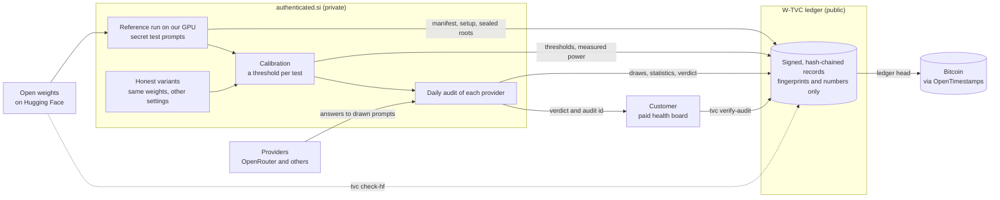
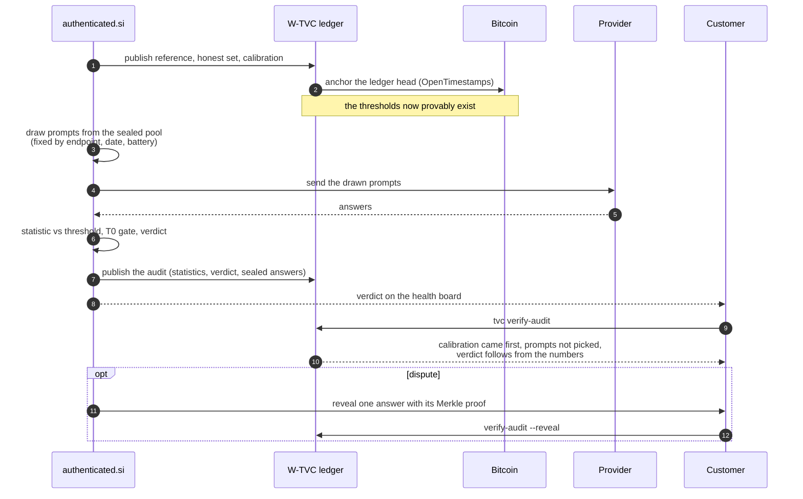
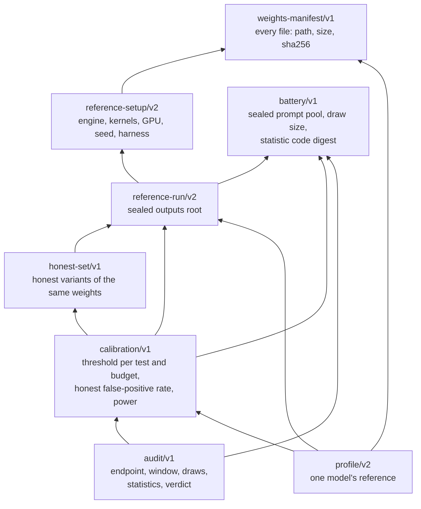
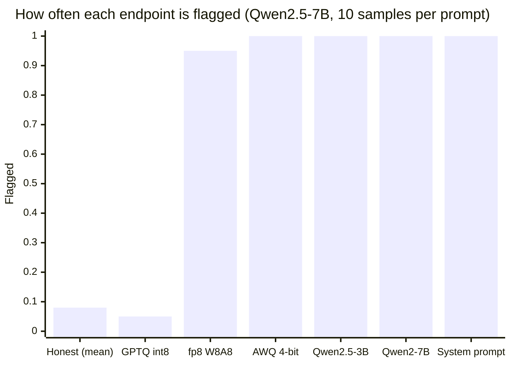

# How W-TVC works, end to end

W-TVC is the open protocol behind authenticated.si's provider checks. authenticated.si keeps its test prompts secret so providers can't game them. W-TVC publishes sealed fingerprints of those tests, the thresholds and every verdict, so anyone can check them later without seeing a single prompt.

## 1. Where it's used

## 2. One day in the life of a provider check

## 3. The documents and how they cite each other

Every arrow is a SHA-256 the document carries and the signed ledger claim repeats.

## 4. What is public and what stays private

| Public, in the ledger | Private, at authenticated.si |
|---|---|
| Which weight files the reference used, with their hashes | The test prompts |
| How the model was run (engine, kernels, GPU, seed) | The reference model's answers |
| A salted Merkle root of the prompts and of the answers | The salts that open those roots |
| Each test's thresholds, honest false-positive rate and measured power | The battery code and the prompt generators |
| Each audit's drawn indices, statistics and verdict | Per-provider history on the paid health board |
| A Bitcoin timestamp on all of the above | |

A single prompt or answer is only opened, with a Merkle proof, when a verdict is disputed. Once opened, it's retired.

## 5. Why thresholds come from honest variants

The same weights served with different kernels, batch sizes or precision give measurably different answers. A plain significance test flags every honest provider. So each threshold is set from honest variants of the same weights, and published with the false-positive rate it gives.

Rejection rate of one calibrated test on Qwen2.5-7B at 10 samples per prompt (from calibration `a72fe242` in `reference/objects/`):

Honest variants are flagged about 8% of the time. A 4-bit copy, a smaller sibling, the previous generation and an injected system prompt are flagged every time. An 8-bit weight-only copy can't be told from honest serving, and the calibration says so in `cannot_detect`. The injected system prompt is also caught by the prompt-token check, which turns the verdict into "misconfigured" instead of "different model".

## 6. What a verifier needs

- The public ledger: `reference/registry.jsonl`, `reference/objects/` and `reference/anchors/`.
- The publisher's 32-byte key, pinned from somewhere you trust.
- `tvc`, built from this repository.
- Optionally, network access to Hugging Face (`check-hf`) and the OpenTimestamps calendars (`verify-anchor`).

No GPU, no account and no access to authenticated.si.
